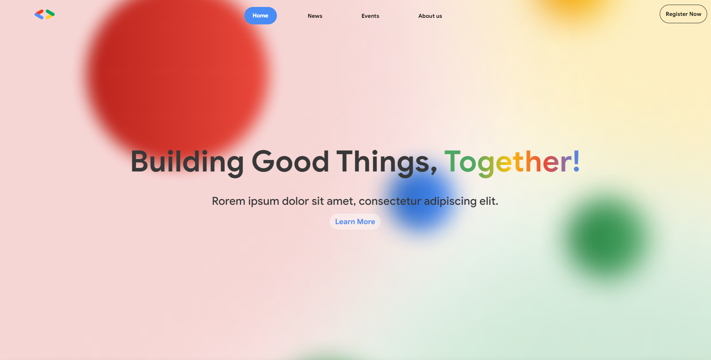
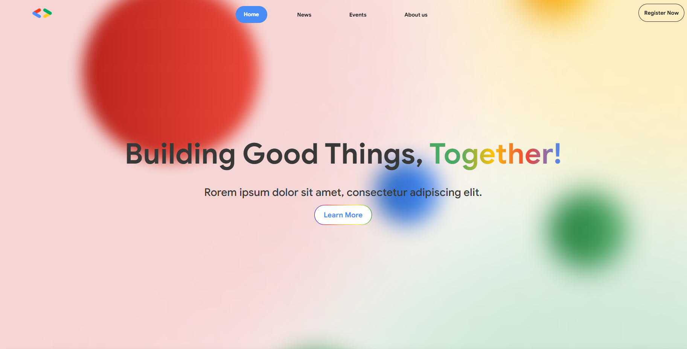
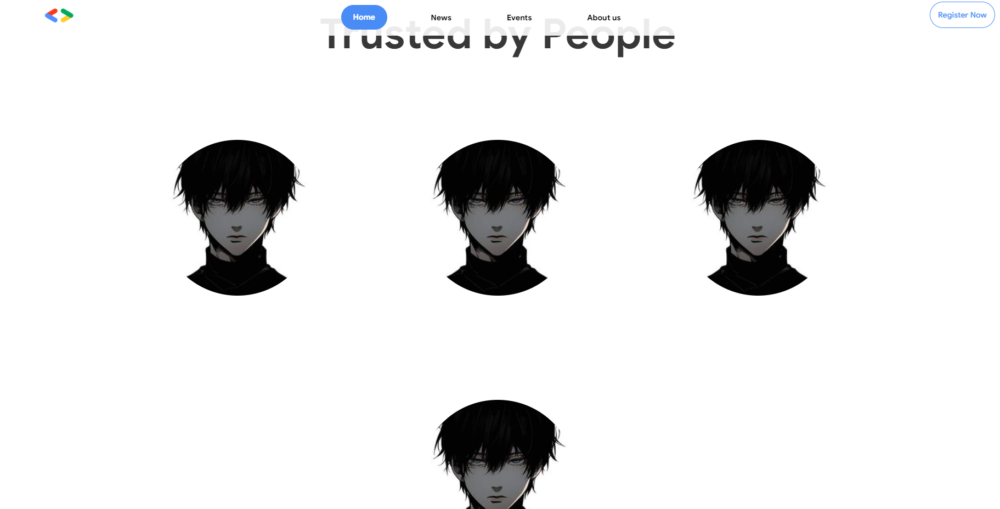
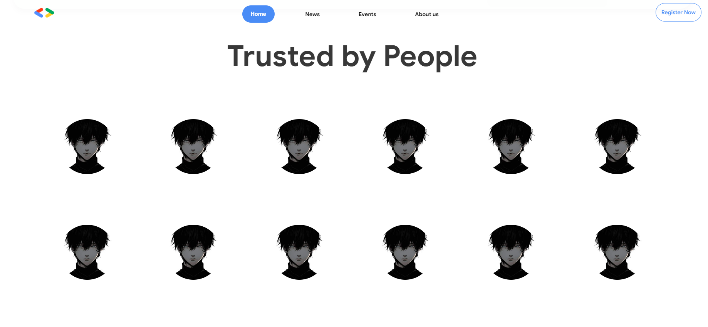
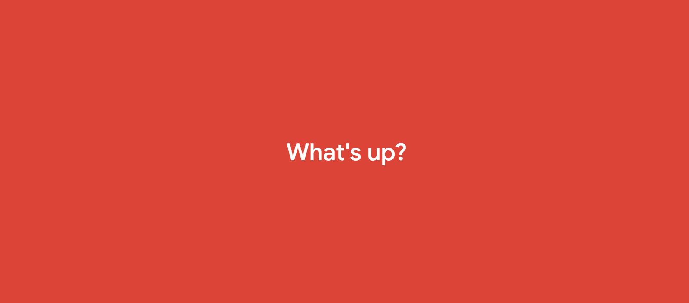
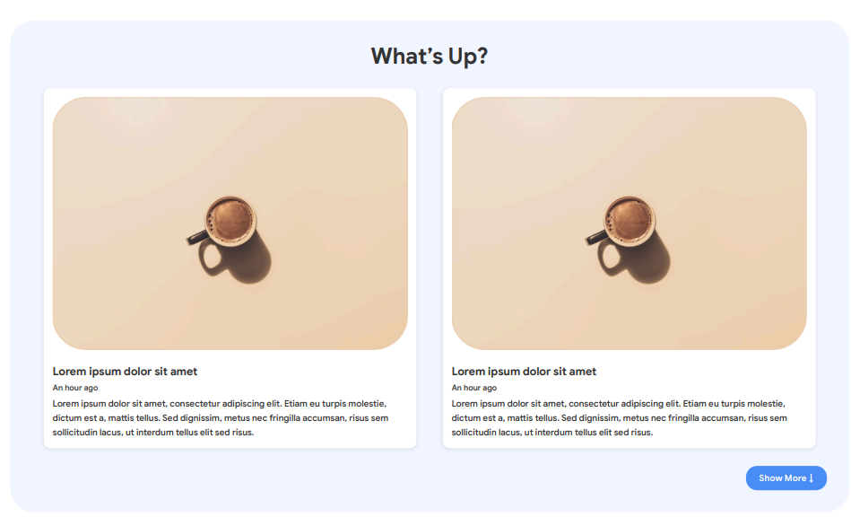

# Pull Request: Homepage, What's Up? and Content Updates

## Changes Summary

### 1. Homepage Banner Button
- **Padding:** Adjusted padding to use Google border colors.
- **Alignment:** Updated padding, margin-top, and border to match the Figma design.

## before:

## after:

### 2. Trusted By People Section
- added more images to align with figma
- changed images width and height to 15vh to align with figma
- changed margin from 10vh to 7 so that all the images fit within 2 lines (align with figma)

## before:

## after:

# Major Changes:
### 3. What's Up Content
- Updated the "What's Up" section with updated content.
- Enhanced alignment and styling based on the Figma design.

## Before:

## After:

